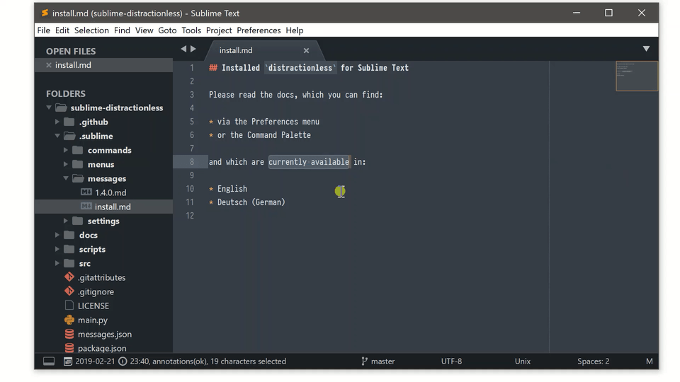

[](https://github.com/jrappen/sublime-distractionless/blob/master/LICENSE)
[](https://www.sublimetext.com)
[](https://packagecontrol.io/packages/distractionless)
[](https://github.com/jrappen/sublime-distractionless/tags)
[](https://discord.gg/D43Pecu)
[](https://www.paypal.me/jrappen)

# `distractionless` plug-in for [Sublime Text](https://www.sublimetext.com)

> Automatic windowed distraction free mode while editing in Sublime Text.

* [Documentation](#documentation)
* [Requirements](#requirements)
* [Installation](#installation)
* [Usage](#usage)
* [Source Code](#source-code)
* [Donations](#donations)



## Documentation

> Plugin documentation is available via the menu or command palette.

* English:
  <https://github.com/jrappen/sublime-distractionless/blob/master/docs/en/README.md>
* German (Deutsch):
  <https://github.com/jrappen/sublime-distractionless/blob/master/docs/de/README.md>

### Code of conduct

<https://github.com/jrappen/.github/blob/master/CODE_OF_CONDUCT.md>

### Contributing guide

<https://github.com/jrappen/.github/blob/master/CONTRIBUTING.md>

## Requirements

`distractionless` targets and is tested against the **latest Build** of Sublime Text, currently requiring **`Build 4074`** or later.

* Download [Sublime Text](https://www.sublimetext.com)
* [Install Package Control](https://packagecontrol.io/installation) via the menu `Tools > Install Package Control`
    * Close and reopen Sublime Text after having installed Package Control.

## Installation

Using **Package Control** is required, as it keeps your packages (with their dependencies) up-to-date!

### Installation via Package Control

* Open the Command Palette (`Tools > Command Palette`).
* Choose `Package Control: Install Package`.
* Search for [`distractionless` on Package Control](https://packagecontrol.io/packages/distractionless) and select to install.

## Usage

`distractionless` makes Sublime Text automatically enter [Distraction Free mode](https://www.sublimetext.com/docs/distraction_free.html) in a windowed environment when you start editing a file.

`distractionless` will then make Sublime Text automatically switch back to normal mode as soon as:

* you save, open or clone a file.
* you open new, switch or close tabs.
* Sublime Text gains focus.

### Settings

Use the settings of Sublime Text to customize how views are displayed in each mode:

* `Preferences > Settings`
* `Preferences > Settings - Syntax Specific`
* `Preferences > Settings - Distraction Free`

You might want to set the following in `Preferences > Settings`:

```jsonc
{
    "auto_hide_menu": true,
    "auto_hide_status_bar": true,
    "auto_hide_tabs": true
}
```

Use the `distractionless` settings to further customize when and what is toggled:

* `Preferences > Package Settings > distractionless > Settings`

Below the currently supported settings:

```jsonc
{
//  number of changes after which UI is toggled automatically
    "distractionless.toggle_after": 1,

//  toggle minimap when switching modes
    "distractionless.toggle_minimap": true,

//  toggle sidebar when switching modes
    "distractionless.toggle_sidebar": true
}
```

## Source Code

<https://www.github.com/jrappen/sublime-distractionless>

### License

<https://github.com/jrappen/sublime-distractionless/blob/master/LICENSE>

### Issues

Please use the command palette or the main menu to report an issue.

## Donations

<https://www.paypal.me/jrappen>
